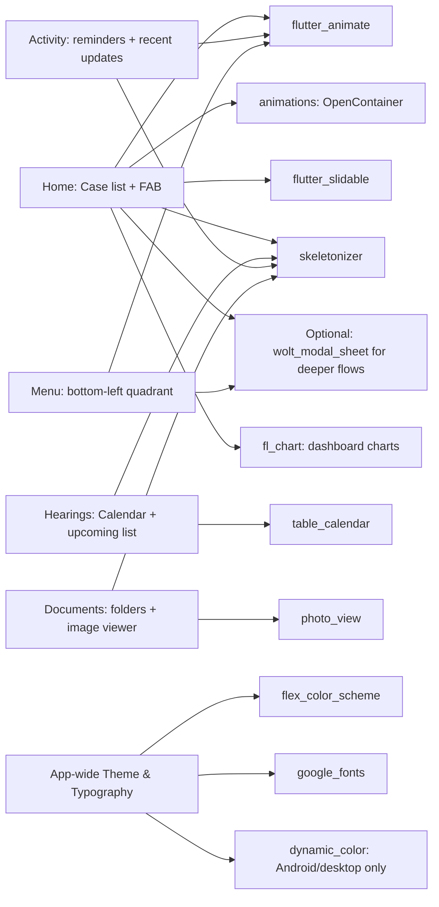

# Deep Research Report: Modern Flutter UI Packages for Advocato

## Executive summary

Advocato is a **mobile-first, offline-first legal practice manager** being developed on **Windows** with primary testing on **Flutter Web** during development. Given your goals (sleek Material 3 UI, professional feel, polished micro-interactions), the best “modern Flutter stack” is a small set of **high-quality, popular packages** that cover: **motion**, **modal workflows**, **theming**, **loading states**, **dashboard visuals**, **calendar interaction**, and **document viewing**.

This report recommends **11 packages** (within your requested 8–12 range) that are broadly compatible with **Flutter 3.41.x / Dart 3.11**, are null-safety compatible by default (Dart 3), and are generally “high signal” on pub.dev by **likes** and **pub points** (pub.dev’s package-scoring metrics). citeturn20search4turn2search12

Key findings:

- For **animations and transitions**, use **flutter_animate** for micro-interactions and **animations** (Flutter team) for Material Motion transitions like **container transform** (perfect for “case card → case details” and “FAB → full-screen add case”). citeturn16view0turn1view0turn17view0turn1view2turn28search7
- For **multi-page modals / wizard flows** (e.g., Add Case as a multi-step form, Dashboard sheet with drill-down), **wolt_modal_sheet** is a modern and actively maintained choice with cross-platform support. citeturn13view1turn24view0turn19view0turn26view8
- For a **professional theming system**, **flex_color_scheme** (Flutter Favorite) gives you consistent Material 3 theming with advanced knobs for surfaces, blending, and component theming. citeturn1view1turn16view1turn26view2
- For **dynamic color**, **dynamic_color** is official and excellent—but it does **not** support **iOS or Web** (important for your Windows + web dev loop). You can still use it with clean fallbacks (seeded schemes) for iOS/web. citeturn3view0turn19view1turn26view3
- For “modern feel” and reduced perceived wait time, **skeletonizer** is the cleanest way to add skeleton loading states (cases list, hearings list, document thumbnails). citeturn4view0turn18view0turn26view7
- For dashboard mini-visualizations, **fl_chart** is popular and flexible across platforms. citeturn14view0turn18view1turn26view5
- For a clean **calendar with event badges**, **table_calendar** is still the most common Flutter “month view” solution and supports web. Note: it has **140/160 pub points** and an **unverified uploader** on pub.dev, so treat it as a dependency you keep an eye on. citeturn21view0turn23view1turn26view9
- For **document zoom & pinch gestures**, **photo_view** is mature and cross-platform; it’s slightly outside your 18-month preference (published 22 months ago), but still strong and widely used. citeturn23view0turn12view0turn26view10

## Selection criteria and evaluation method

Packages were prioritized using:

- **Popularity / social proof**: pub.dev **likes** and download volume (where visible). citeturn2search12turn20search4
- **Quality signals**: pub.dev **pub points** and the platform support section from the pub score report. citeturn16view0turn17view0turn19view2turn18view1turn23view1
- **Recency**: preference for packages published within **~18 months** of **2026-02-23** (≈ since late Aug 2024), with explicit flags where a package is older.
- **Cross-platform**: Android/iOS/web support prioritized. Where not fully supported (notably **dynamic_color**), the limitation is clearly called out with fallback guidance. citeturn19view1
- **Primary sources**: pub.dev pages and GitHub repos (for each package) are included. citeturn26view0turn26view1turn26view2turn26view3turn26view4turn26view5turn26view6turn26view7turn26view8turn26view9turn26view10

## Recommended package stack overview

The following stack is “coverage-complete” for Advocato’s UI goals (dashboard, FAB, card animations, calendar badges, document gallery, modal sheets, hamburger quadrant interactions).

| Package | Primary role in Advocato | Version (as of sources) | Published | Platforms | Likes / Pub points |
|---|---|---:|---:|---|---|
| flutter_animate | Micro-interactions, subtle motion | ^4.5.2 | 15 months ago | Android/iOS/web/desktop | ~4.1k / 150 citeturn16view0 |
| animations | Material Motion (OpenContainer, SharedAxis) | ^2.1.1 | 3 months ago | Android/iOS/web/desktop | ~6.7k / 160 citeturn17view0 |
| wolt_modal_sheet | Multi-page modals, responsive sheets | ^0.11.0 | 12 months ago | Android/iOS/web/desktop | ~1.4k / 150 citeturn19view0 |
| skeletonizer | Skeleton loading states | ^2.1.3 | 9 days ago | Android/iOS/web/desktop | ~2.2k / 160 citeturn18view0 |
| flutter_slidable | Swipe actions on case/hearing lists | ^4.0.3 | 4 months ago | Android/iOS/web/desktop | ~6.0k / 150 citeturn17view1 |
| fl_chart | Dashboard charts | ^1.1.1 | 5 months ago | Android/iOS/web/desktop | ~7.0k / 150 citeturn18view1 |
| table_calendar | Hearings calendar with event badges | ^3.2.0 | 13 months ago | Android/iOS/web/desktop | ~3.3k / 140 citeturn23view1 |
| photo_view | Document zoom/gallery | ^0.15.0 | 22 months ago | Android/iOS/web/desktop | ~3.1k / 150 citeturn23view0 |
| flex_color_scheme | Material 3 theming + color system | ^8.4.0 | 2 months ago | Android/iOS/web/desktop | ~3.1k / 160 citeturn16view1 |
| dynamic_color | Dynamic color (Android/desktop) | ^1.8.1 | 6 months ago | Android/desktop only | 624 / 150 citeturn19view1 |
| google_fonts | Typography polish + bundled fonts | ^8.0.2 | 4 days ago | Android/iOS/web/desktop | ~6.4k / 160 citeturn19view2 |

## Package deep dives

### flutter_animate

**Links**
- pub.dev: `https://pub.dev/packages/flutter_animate` citeturn1view0turn16view0  
- GitHub: `https://github.com/gskinner/flutter_animate` citeturn26view0

**Short description**  
A performant, unified API for adding animated effects (fade/scale/slide/blur/shake/shimmer, etc.) via `Animate()` or `.animate()` extensions. citeturn1view0turn26view0

**Why it fits Advocato**
- **Case cards**: subtle fade + slide-in on list load (premium feel).
- **FAB**: scale/rotate micro-interaction on tap.
- **Menu quadrant**: smooth slide-in + fade + blur overlay without writing manual `AnimationController` plumbing.
- **Dashboard**: animate counters and chart panels.

**Key features**
- Pre-built effect chaining (`.fade()`, `.scale()`, `.move()`, `.blur()`) and timing extensions like `300.ms`. citeturn1view0
- Strong quality signals: ~4.1k likes and **150/160 pub points** with full platform support report. citeturn16view0

**Installation snippet**
```yaml
dependencies:
  flutter_animate: ^4.5.2
```
citeturn16view0

**Minimal example code: Animated FAB for “Add Case”**
```dart
import 'package:flutter/material.dart';
import 'package:flutter_animate/flutter_animate.dart';

class AnimatedAddCaseFab extends StatelessWidget {
  const AnimatedAddCaseFab({super.key, required this.onPressed});

  final VoidCallback onPressed;

  @override
  Widget build(BuildContext context) {
    return FloatingActionButton(
      onPressed: onPressed,
      child: const Icon(Icons.add),
    )
        // entrance animation (when widget first appears)
        .animate()
        .fadeIn(duration: 250.ms)
        .scale(begin: const Offset(0.9, 0.9), duration: 250.ms)
        // micro-interaction pulse (loop gently)
        .then(delay: 800.ms)
        .scale(
          begin: const Offset(1.0, 1.0),
          end: const Offset(1.04, 1.04),
          duration: 900.ms,
          curve: Curves.easeInOut,
        )
        .then()
        .scale(
          begin: const Offset(1.04, 1.04),
          end: const Offset(1.0, 1.0),
          duration: 900.ms,
          curve: Curves.easeInOut,
        );
  }
}
```

**Compatibility notes**
- Reported support includes Android/iOS/web/Windows/macOS/Linux. citeturn16view0

**Caveats**
- Keep animations subtle (legal apps should feel calm and “serious”). Overuse can feel gimmicky.

**One-line Cursor prompt**
> Add flutter_animate: create `AnimatedAddCaseFab` that fades/scales in and provides a gentle pulse micro-interaction; replace the Home FAB with it.

---

### animations

**Links**
- pub.dev: `https://pub.dev/packages/animations` citeturn1view2turn17view0  
- GitHub: `https://github.com/flutter/packages/tree/main/packages/animations` citeturn26view1

**Short description**  
Official Flutter package implementing “Material motion” transitions (container transform, shared axis, fade through, etc.). citeturn1view2turn28search7

**Why it fits Advocato**
- **Case card → case detail**: **container transform** makes navigation feel premium and intuitive.
- **Bottom-nav switching**: **fade through** or **shared axis** transitions reduce harsh page swaps.
- **FAB → Add Case sheet**: container transform can visually connect the FAB to the form. citeturn1view2

**Key features**
- Material Motion patterns (container transform / shared axis / fade through / fade). citeturn1view2
- Very strong quality signals (**160/160 pub points**, full platform support). citeturn17view0

**Installation snippet**
```yaml
dependencies:
  animations: ^2.1.1
```
citeturn17view0

**Minimal example code: Case card container transform**
```dart
import 'package:animations/animations.dart';
import 'package:flutter/material.dart';

class CaseCardToDetail extends StatelessWidget {
  const CaseCardToDetail({
    super.key,
    required this.title,
    required this.detailBuilder,
  });

  final String title;
  final WidgetBuilder detailBuilder;

  @override
  Widget build(BuildContext context) {
    return OpenContainer(
      transitionType: ContainerTransitionType.fadeThrough,
      transitionDuration: const Duration(milliseconds: 350),
      closedColor: Theme.of(context).colorScheme.surface,
      openColor: Theme.of(context).colorScheme.surface,
      closedElevation: 0,
      openElevation: 0,
      closedBuilder: (context, open) {
        return InkWell(
          onTap: open,
          borderRadius: BorderRadius.circular(16),
          child: Card(
            elevation: 0.5,
            shape: RoundedRectangleBorder(borderRadius: BorderRadius.circular(16)),
            child: ListTile(
              title: Text(title),
              subtitle: const Text('Next hearing: 12/03/2026 • District Court'),
              trailing: const Icon(Icons.chevron_right),
            ),
          ),
        );
      },
      openBuilder: (context, _) => detailBuilder(context),
    );
  }
}
```

**Compatibility notes**
- Full platform support (including web) in the pub score report. citeturn17view0

**Caveats**
- Use this package for “big” navigation transitions; use flutter_animate for small micro-interactions (avoid stacking multiple heavy transitions at once).

**One-line Cursor prompt**
> Add animations package: implement `CaseCardToDetail` using `OpenContainer` so case cards morph into the CaseDetail screen.

---

### wolt_modal_sheet

**Links**
- pub.dev: `https://pub.dev/packages/wolt_modal_sheet` citeturn13view1turn19view0turn24view0  
- GitHub: `https://github.com/woltapp/wolt_modal_sheet` citeturn26view8

**Short description**  
A modern, responsive modal sheet system with **multi-page** flows and motion transitions; can behave like a bottom sheet or dialog depending on screen size and configuration. citeturn24view0turn13view1

**Why it fits Advocato**
- **Add Case**: multi-step “wizard” inside a sheet (Basic Info → Court → Client → Opposite Party → Review).
- **Dashboard modal**: multi-page sheet with “Totals” → “Cases by type” → “Overdue / upcoming”.
- **Menu interactions**: while your “bottom-left quadrant menu” is custom, Wolt is still excellent for settings/profile flows launched from that menu.

**Key features**
- Multi-page layout, responsive design, and built-in motion with both imperative + declarative navigation patterns. citeturn24view0turn13view1
- Strong quality signals: cross-platform and **150/160 pub points**. citeturn19view0

**Installation snippet**
```yaml
dependencies:
  wolt_modal_sheet: ^0.11.0
```
citeturn13view1turn19view0

**Minimal example code: Dashboard modal as a Wolt sheet**
```dart
import 'package:flutter/material.dart';
import 'package:wolt_modal_sheet/wolt_modal_sheet.dart';

void showDashboardSheet(BuildContext context) {
  WoltModalSheet.show<void>(
    context: context,
    pageListBuilder: (modalContext) {
      final textTheme = Theme.of(context).textTheme;

      return [
        WoltModalSheetPage(
          topBarTitle: Text('Dashboard', style: textTheme.titleMedium),
          isTopBarLayerAlwaysVisible: true,
          trailingNavBarWidget: IconButton(
            icon: const Icon(Icons.close),
            onPressed: () => Navigator.of(modalContext).pop(),
          ),
          child: Padding(
            padding: const EdgeInsets.all(16),
            child: Column(
              children: [
                _StatTile(label: 'Total cases', value: '42'),
                _StatTile(label: 'Pending hearings', value: '7'),
                const SizedBox(height: 12),
                ElevatedButton(
                  onPressed: WoltModalSheet.of(modalContext).showNext,
                  child: const Text('View breakdown'),
                ),
              ],
            ),
          ),
        ),
        WoltModalSheetPage(
          topBarTitle: Text('Breakdown', style: textTheme.titleMedium),
          leadingNavBarWidget: IconButton(
            icon: const Icon(Icons.arrow_back),
            onPressed: WoltModalSheet.of(modalContext).showPrevious,
          ),
          trailingNavBarWidget: IconButton(
            icon: const Icon(Icons.close),
            onPressed: () => Navigator.of(modalContext).pop(),
          ),
          child: const Padding(
            padding: EdgeInsets.all(16),
            child: Text('TODO: Put charts here (fl_chart).'),
          ),
        ),
      ];
    },
  );
}

class _StatTile extends StatelessWidget {
  const _StatTile({required this.label, required this.value});
  final String label;
  final String value;

  @override
  Widget build(BuildContext context) {
    return Card(
      child: ListTile(
        title: Text(label),
        trailing: Text(value, style: Theme.of(context).textTheme.titleLarge),
      ),
    );
  }
}
```
(Example invocation pattern shown in Wolt docs.) citeturn24view0

**Compatibility notes**
- Full platform support including web/desktop in pub score report. citeturn19view0

**Caveats**
- Heavier than a basic `showModalBottomSheet`. Use it where multi-page flows truly add UX value.
- Your **bottom-left quadrant menu** is still best implemented as a custom overlay (see micro-interaction section).

**One-line Cursor prompt**
> Add wolt_modal_sheet: create `showDashboardSheet(context)` with two pages (stats → breakdown) and wire it to the Dashboard icon on Home.

---

### skeletonizer

**Links**
- pub.dev: `https://pub.dev/packages/skeletonizer` citeturn4view0turn18view0  
- GitHub: `https://github.com/Milad-Akarie/skeletonizer` citeturn26view7

**Short description**  
Converts existing UI layouts into skeleton loaders (typically shimmer-like) with minimal extra markup. citeturn4view0

**Why it fits Advocato**
- **Home cases list**: show skeleton cards while DB loads.
- **Hearings list**: skeleton rows while computing next-7-day list.
- **Documents**: skeleton grid of thumbnails while images decode.

**Key features**
- Wrap any layout in `Skeletonizer(enabled: ...)` and it will skeletonize children. citeturn4view0
- Excellent quality signals: recent publish and **160/160 pub points**, full platform support. citeturn18view0

**Installation snippet**
```yaml
dependencies:
  skeletonizer: ^2.1.3
```
citeturn18view0

**Minimal example code: Skeleton case cards**
```dart
import 'package:flutter/material.dart';
import 'package:skeletonizer/skeletonizer.dart';

class CaseListWithSkeleton extends StatelessWidget {
  const CaseListWithSkeleton({super.key, required this.isLoading, required this.cases});

  final bool isLoading;
  final List<String> cases;

  @override
  Widget build(BuildContext context) {
    final data = isLoading
        ? List.generate(6, (_) => 'Case Title')
        : cases;

    return Skeletonizer(
      enabled: isLoading,
      child: ListView.separated(
        padding: const EdgeInsets.all(16),
        itemCount: data.length,
        separatorBuilder: (_, __) => const SizedBox(height: 12),
        itemBuilder: (context, index) {
          return Card(
            child: ListTile(
              title: Text(data[index]),
              subtitle: const Text('Next hearing: DD/MM/YYYY'),
              trailing: const Icon(Icons.chevron_right),
            ),
          );
        },
      ),
    );
  }
}
```

**Compatibility notes**
- Full platform support (including web) and high pub points. citeturn18view0

**Caveats**
- If your “real” layout depends on non-null data (e.g., `Image.network`), you may need skeleton annotations or safe placeholders. The docs explicitly discuss providing fake data so skeletonizer has a “shape” to render. citeturn4view0

**One-line Cursor prompt**
> Add skeletonizer: wrap the Home case list in `Skeletonizer` and show 6 fake case tiles while local DB initializes.

---

### flutter_slidable

**Links**
- pub.dev: `https://pub.dev/packages/flutter_slidable` citeturn6view0turn17view1  
- GitHub: `https://github.com/letsar/flutter_slidable` citeturn26view6

**Short description**  
A high-quality slidable list item widget with swipe actions (edit/delete/archive), including multiple built-in motion styles. citeturn6view0

**Why it fits Advocato**
- **Home case cards**: swipe right for “Edit”, swipe left for “Close/Archive/Delete”.
- **Hearings**: mark “Done”, add “Outcome”.
- **Document folders**: rename/delete actions without cluttering UI.

**Key features**
- Start/end action panes, dismissible behavior, multiple built-in motions. citeturn6view0
- Strong quality signals: **150/160 pub points** and full platform support. citeturn17view1

**Installation snippet**
```yaml
dependencies:
  flutter_slidable: ^4.0.3
```
citeturn6view0turn17view1

**Minimal example code: Slidable case card**
```dart
import 'package:flutter/material.dart';
import 'package:flutter_slidable/flutter_slidable.dart';

class SlidableCaseCard extends StatelessWidget {
  const SlidableCaseCard({
    super.key,
    required this.title,
    required this.onEdit,
    required this.onDelete,
  });

  final String title;
  final VoidCallback onEdit;
  final VoidCallback onDelete;

  @override
  Widget build(BuildContext context) {
    return Slidable(
      key: ValueKey(title),
      startActionPane: ActionPane(
        motion: const DrawerMotion(),
        children: [
          SlidableAction(
            onPressed: (_) => onEdit(),
            icon: Icons.edit,
            label: 'Edit',
          ),
        ],
      ),
      endActionPane: ActionPane(
        motion: const BehindMotion(),
        children: [
          SlidableAction(
            onPressed: (_) => onDelete(),
            icon: Icons.delete,
            label: 'Delete',
            backgroundColor: Theme.of(context).colorScheme.error,
            foregroundColor: Theme.of(context).colorScheme.onError,
          ),
        ],
      ),
      child: Card(
        child: ListTile(
          title: Text(title),
          subtitle: const Text('Next hearing: 12/03/2026'),
        ),
      ),
    );
  }
}
```

**Compatibility notes**
- Full platform support including web. citeturn17view1

**Caveats**
- On web/desktop, “swipe” becomes pointer-drag; it still works, but ensure the UI is also operable via explicit menu actions for accessibility.

**One-line Cursor prompt**
> Add flutter_slidable: make case cards slidable with Edit (start pane) and Delete (end pane) actions; wire to placeholder callbacks.

---

### fl_chart

**Links**
- pub.dev: `https://pub.dev/packages/fl_chart` citeturn14view0turn18view1  
- GitHub: `https://github.com/imaNNeo/fl_chart` citeturn26view5

**Short description**  
Highly customizable charts (line, bar, pie, scatter, radar, etc.) with animations and interaction support, usable across platforms. citeturn14view0

**Why it fits Advocato**
- **Dashboard modal**: show “cases by type” as a small pie, “hearings this week” as bars.
- **Activity insights** (optional later): trend chart of hearings/month.
- **Visual break from text-heavy lists** (important for lawyer workflows).

**Key features**
- Multiple chart types and strong community adoption + cross-platform support. citeturn14view0turn18view1

**Installation snippet**
```yaml
dependencies:
  fl_chart: ^1.1.1
```
citeturn14view0turn18view1

**Minimal example code: Dashboard bar chart**
```dart
import 'package:fl_chart/fl_chart.dart';
import 'package:flutter/material.dart';

class HearingsThisWeekBarChart extends StatelessWidget {
  const HearingsThisWeekBarChart({super.key});

  @override
  Widget build(BuildContext context) {
    return SizedBox(
      height: 160,
      child: BarChart(
        BarChartData(
          gridData: const FlGridData(show: false),
          borderData: FlBorderData(show: false),
          titlesData: const FlTitlesData(show: false),
          barGroups: [
            BarChartGroupData(x: 0, barRods: [BarChartRodData(toY: 2)]),
            BarChartGroupData(x: 1, barRods: [BarChartRodData(toY: 5)]),
            BarChartGroupData(x: 2, barRods: [BarChartRodData(toY: 1)]),
            BarChartGroupData(x: 3, barRods: [BarChartRodData(toY: 3)]),
            BarChartGroupData(x: 4, barRods: [BarChartRodData(toY: 4)]),
            BarChartGroupData(x: 5, barRods: [BarChartRodData(toY: 0)]),
          ],
        ),
      ),
    );
  }
}
```

**Compatibility notes**
- Full platform support including web/desktop per pub score report. citeturn18view1

**Caveats**
- Chart styling can become verbose; define a small internal “chart style system” to keep UI consistent.
- For large datasets, avoid rebuilding charts too frequently.

**One-line Cursor prompt**
> Add fl_chart: create `HearingsThisWeekBarChart` widget and display it inside the Dashboard modal (Wolt sheet page 1 or 2).

---

### table_calendar

**Links**
- pub.dev: `https://pub.dev/packages/table_calendar` citeturn21view0turn23view1  
- GitHub: `https://github.com/aleksanderwozniak/table_calendar` citeturn26view9

**Short description**  
A feature-packed calendar widget (month/two weeks/week formats) with extensive customization and event support. citeturn21view0

**Why it fits Advocato**
- **Hearings tab** month view with **badge counts** (1,2,3…) on dates.
- Tap date → show list of cases on that date (your SRD requirement).
- Works well for an offline-first scheduling workflow.

**Key features**
- Custom builders, range/selection support, event loading via `eventLoader`. citeturn21view0
- Platform support includes web/desktop in package + score. citeturn21view0turn23view1

**Installation snippet**
```yaml
dependencies:
  table_calendar: ^3.2.0
```
citeturn21view0turn23view1

**Minimal example code: Calendar with badge counts**
```dart
import 'package:flutter/material.dart';
import 'package:table_calendar/table_calendar.dart';

class HearingsCalendar extends StatefulWidget {
  const HearingsCalendar({super.key});

  @override
  State<HearingsCalendar> createState() => _HearingsCalendarState();
}

class _HearingsCalendarState extends State<HearingsCalendar> {
  DateTime _focusedDay = DateTime.now();
  DateTime? _selectedDay;

  // Example: map day -> number of hearings
  final Map<DateTime, int> _hearingCount = {};

  @override
  void initState() {
    super.initState();
    // Fake data (normalize to date-only)
    final today = DateTime(DateTime.now().year, DateTime.now().month, DateTime.now().day);
    _hearingCount[today] = 2;
    _hearingCount[today.add(const Duration(days: 3))] = 1;
  }

  int _countForDay(DateTime day) {
    final k = DateTime(day.year, day.month, day.day);
    return _hearingCount[k] ?? 0;
  }

  @override
  Widget build(BuildContext context) {
    return TableCalendar<void>(
      firstDay: DateTime.utc(2020, 1, 1),
      lastDay: DateTime.utc(2035, 12, 31),
      focusedDay: _focusedDay,
      selectedDayPredicate: (d) => isSameDay(_selectedDay, d),
      onDaySelected: (selected, focused) {
        setState(() {
          _selectedDay = selected;
          _focusedDay = focused;
        });
      },
      onPageChanged: (focused) => _focusedDay = focused,
      calendarBuilders: CalendarBuilders(
        markerBuilder: (context, day, events) {
          final count = _countForDay(day);
          if (count <= 0) return null;

          return Align(
            alignment: Alignment.bottomRight,
            child: Container(
              padding: const EdgeInsets.all(4),
              decoration: BoxDecoration(
                shape: BoxShape.circle,
                color: Theme.of(context).colorScheme.primary,
              ),
              child: Text(
                '$count',
                style: TextStyle(
                  fontSize: 10,
                  color: Theme.of(context).colorScheme.onPrimary,
                ),
              ),
            ),
          );
        },
      ),
    );
  }
}
```

**Compatibility notes**
- Full platform support (including web) per score report. citeturn23view1

**Caveats**
- Pub score is **140/160**, and pub.dev lists an **unverified uploader**—not necessarily unsafe, but you should pin versions and monitor updates. citeturn23view1
- Watch date normalization: `DateTime` has time; most calendar event maps need date-only keys (as noted in package docs). citeturn21view0

**One-line Cursor prompt**
> Add table_calendar: implement Hearings tab month view with per-day badge counts and tap-to-select date state.

---

### photo_view

**Links**
- pub.dev: `https://pub.dev/packages/photo_view` citeturn12view0turn23view0  
- GitHub: `https://github.com/bluefireteam/photo_view` citeturn26view10turn27view0

**Short description**  
Zoomable image/widget viewer with pinch, pan, rotation; includes `PhotoViewGallery` for multi-image browsing. citeturn12view0

**Why it fits Advocato**
- **Documents tab**: tap thumbnail → full-screen viewer with pinch-zoom (critical for legal scans).
- **Gallery**: browse multi-page evidence photos in order.
- Works on web (important for your dev setup) and supports hero-style transitions via `heroAttributes`. citeturn12view0turn23view0

**Key features**
- `PhotoView` for single image and `PhotoViewGallery.builder` for collections. citeturn12view0
- Strong quality signals: 150/160 pub points, full platform support, wasm-ready noted in score report. citeturn23view0

**Installation snippet**
```yaml
dependencies:
  photo_view: ^0.15.0
```
citeturn23view0

**Minimal example code: Case document viewer**
```dart
import 'package:flutter/material.dart';
import 'package:photo_view/photo_view_gallery.dart';

class DocumentGalleryViewer extends StatelessWidget {
  const DocumentGalleryViewer({
    super.key,
    required this.imageProviders,
    required this.initialIndex,
  });

  final List<ImageProvider> imageProviders;
  final int initialIndex;

  @override
  Widget build(BuildContext context) {
    final controller = PageController(initialPage: initialIndex);

    return Scaffold(
      appBar: AppBar(title: const Text('Documents')),
      body: PhotoViewGallery.builder(
        pageController: controller,
        itemCount: imageProviders.length,
        builder: (context, index) {
          return PhotoViewGalleryPageOptions(
            imageProvider: imageProviders[index],
            heroAttributes: PhotoViewHeroAttributes(tag: 'doc_$index'),
          );
        },
      ),
    );
  }
}
```

**Compatibility notes**
- Cross-platform including web; score report notes wasm compatibility. citeturn23view0

**Caveats**
- Slightly outside your “updated within 18 months” preference (published 22 months ago). citeturn23view0
- Score report mentions some deprecated internal API usage and partial static analysis issues; consider pinning version and checking updates periodically. citeturn23view0

**One-line Cursor prompt**
> Add photo_view: implement `DocumentGalleryViewer` and open it when a document thumbnail is tapped (Hero tag per index).

---

### flex_color_scheme

**Links**
- pub.dev: `https://pub.dev/packages/flex_color_scheme` citeturn1view1turn16view1  
- GitHub: `https://github.com/rydmike/flex_color_scheme` citeturn26view2turn27view4

**Short description**  
A comprehensive theming library for Material apps, offering advanced ColorScheme generation and consistent component theming to produce polished, coherent UI. citeturn1view1turn16view1

**Why it fits Advocato**
- Legal apps need a consistent professional palette across surfaces, borders, elevation, and typography.
- Helps you build a “design system” quickly: unified radii, component styling knobs, and seeded Material 3 schemes.

**Key features**
- Sophisticated `ThemeData` generation based on ColorScheme and Material 3 mode, plus component theme customization. citeturn1view1
- Excellent quality signals: Flutter Favorite and **160/160 pub points** with cross-platform support. citeturn1view1turn16view1

**Installation snippet**
```yaml
dependencies:
  flex_color_scheme: ^8.4.0
```
citeturn16view1

**Minimal example code: Advocato theme using seeded scheme**
```dart
import 'package:flex_color_scheme/flex_color_scheme.dart';
import 'package:flutter/material.dart';

ThemeData buildAdvocatoLightTheme() {
  const seed = Color(0xFF1E3A5F); // Your SRD primary
  return FlexThemeData.light(
    scheme: FlexScheme.materialBaseline,
    useMaterial3: true,
    colorScheme: ColorScheme.fromSeed(seedColor: seed),
    subThemesData: const FlexSubThemesData(
      // Centralized “modern UI” knobs:
      defaultRadius: 16,
      elevatedButtonRadius: 16,
      inputDecoratorRadius: 16,
      cardRadius: 16,
      dialogRadius: 18,
    ),
  );
}

ThemeData buildAdvocatoDarkTheme() {
  const seed = Color(0xFF1E3A5F);
  return FlexThemeData.dark(
    useMaterial3: true,
    colorScheme: ColorScheme.fromSeed(seedColor: seed, brightness: Brightness.dark),
    subThemesData: const FlexSubThemesData(
      defaultRadius: 16,
      cardRadius: 16,
      inputDecoratorRadius: 16,
    ),
  );
}
```
(Material 3 seeded schemes are supported by Flutter’s `ColorScheme.fromSeed`.) citeturn22search18turn1view1

**Compatibility notes**
- Full platform support and high pub points. citeturn16view1

**Caveats**
- It’s a large theming surface area—decide early which features you “standardize” (radii, elevations, input styles) to avoid inconsistent UI.

**One-line Cursor prompt**
> Add flex_color_scheme: create `buildAdvocatoLightTheme()`/`buildAdvocatoDarkTheme()` using Material 3 + seeded scheme + unified radius, and apply to `MaterialApp`.

---

### dynamic_color

**Links**
- pub.dev: `https://pub.dev/packages/dynamic_color` citeturn3view0turn19view1  
- GitHub: `https://github.com/material-foundation/flutter-packages/tree/main/packages/dynamic_color` citeturn26view3

**Short description**  
Provides Material color schemes based on OS dynamic color capabilities (notably Android 12+ wallpaper-derived color), with harmonization support. citeturn3view0turn19view1

**Why it fits Advocato**
- Gives Android 12+ users a “native modern” look automatically (dynamic scheme) while keeping your design system intact.
- Useful if you later add a “Theme: Auto (Dynamic)” option in settings.

**Key features**
- `DynamicColorBuilder` returns dynamic light/dark `ColorScheme?`. citeturn3view0
- Strong quality signals (150/160 pub points). citeturn19view1

**Installation snippet**
```yaml
dependencies:
  dynamic_color: ^1.8.1
```
citeturn3view0turn19view1

**Minimal example code: Dynamic color with fallback (important for web dev)**
```dart
import 'package:dynamic_color/dynamic_color.dart';
import 'package:flutter/material.dart';

class AdvocatoApp extends StatelessWidget {
  const AdvocatoApp({super.key});

  @override
  Widget build(BuildContext context) {
    const seed = Color(0xFF1E3A5F);

    return DynamicColorBuilder(
      builder: (ColorScheme? lightDynamic, ColorScheme? darkDynamic) {
        final light = lightDynamic ?? ColorScheme.fromSeed(seedColor: seed);
        final dark = darkDynamic ?? ColorScheme.fromSeed(seedColor: seed, brightness: Brightness.dark);

        return MaterialApp(
          theme: ThemeData(colorScheme: light, useMaterial3: true),
          darkTheme: ThemeData(colorScheme: dark, useMaterial3: true),
          home: const Scaffold(body: Center(child: Text('Advocato'))),
        );
      },
    );
  }
}
```

**Compatibility notes**
- **Important**: official pub score report shows it supports **Android + desktop**, but **does not support iOS or Web**. For your workflow (developing/testing on Chrome), this means it will not provide dynamic colors there—use fallbacks as shown. citeturn19view1turn3view0

**Caveats**
- Treat dynamic color as an enhancement, not a requirement, given your iOS + web targets. citeturn19view1

**One-line Cursor prompt**
> Add dynamic_color: wrap `MaterialApp` in `DynamicColorBuilder` and implement seeded fallbacks for iOS/web so the app theme stays consistent during Chrome development.

---

### google_fonts

**Links**
- pub.dev: `https://pub.dev/packages/google_fonts` citeturn5view0turn19view2  
- GitHub: `https://github.com/flutter/packages/tree/main/packages/google_fonts` citeturn26view4

**Short description**  
Easy integration of Google Fonts, supporting runtime fetching, caching, and **asset bundling**—important for offline-first apps like Advocato. citeturn5view0turn19view2

**Why it fits Advocato**
- Typography is the fastest way to make an app feel “premium”.
- Asset bundling supports your offline-first requirement (avoid font fetching in production). citeturn5view0

**Key features**
- Provides `GoogleFonts.<fontName>()`, plus `...TextTheme()` helpers. citeturn5view0
- Explicit docs about bundling fonts and licensing. citeturn5view0

**Installation snippet**
```yaml
dependencies:
  google_fonts: ^8.0.2
```
citeturn5view0turn19view2

**Minimal example code: Advocato typography**
```dart
import 'package:flutter/material.dart';
import 'package:google_fonts/google_fonts.dart';

ThemeData applyAdvocatoTypography(ThemeData base) {
  return base.copyWith(
    textTheme: GoogleFonts.interTextTheme(base.textTheme),
  );
}
```

**Compatibility notes**
- Full platform support in score report. citeturn19view2

**Caveats**
- If you don’t bundle fonts, the package may fetch over HTTP (fine for development, not ideal for offline-first production). The docs explicitly describe bundling matching font files in assets to avoid runtime fetching. citeturn5view0
- Fonts carry their own licenses; docs advise including appropriate licenses in-app. citeturn3view1

**One-line Cursor prompt**
> Add google_fonts: apply Inter as the global `textTheme` and add a `TypographyPreview` widget to verify headings/body styles.

---

## Theming, color systems, and typography

A legal app should feel **calm, trustworthy, and structured**. In Flutter, this is usually achieved by:

- **One coherent ColorScheme** (light + dark)
- **Consistent component shapes** (same radius across cards/buttons/dialogs)
- A professional font that stays legible at small sizes

### Recommended approach for Advocato

Use:

- **flex_color_scheme** for shaping components consistently and building refined Material 3 themes. citeturn1view1turn16view1
- **dynamic_color** as an optional enhancement on supported platforms (Android + desktop), with **seeded fallback** on iOS/web. citeturn19view1turn3view0
- Flutter’s `ColorScheme.fromSeed` for predictable seed-based palettes and tonal palettes (Material 3 behavior). citeturn22search18

### Palette guidance

For a Pakistani legal workflow app, your SRD-defined base makes sense (navy/blue-gray primary). If you want a “modern legal” feel, keep:

- Primary: deep navy (your SRD: `#1E3A5F`)
- Secondary: muted teal or slate accent
- Error: default Material 3 error red for clarity
- Surfaces: near-white in light mode; deep gray in dark mode (avoid pure black)

### Font recommendations and usage examples

Using **google_fonts**, these are safe “modern-professional” picks:

- **Inter**: neutral, legible, modern (great for dense lists like cases/hearings).
- **Source Sans 3**: very readable and slightly more “editorial”, good for notes/doc labels.
- **Manrope**: a bit more geometric, good if you want a distinctive but still professional UI.

Example (choose one as default, one as “display” if desired):
```dart
final base = ThemeData(useMaterial3: true);

final theme = base.copyWith(
  textTheme: GoogleFonts.interTextTheme(base.textTheme).copyWith(
    titleLarge: GoogleFonts.manrope(textStyle: base.textTheme.titleLarge),
  ),
);
```
(google_fonts provides `...TextTheme()` helpers and supports bundling fonts for offline-first production.) citeturn5view0turn19view2

## Micro-interaction playbook and package mapping

### Micro-interaction patterns that work well for a legal app

| Pattern | Why it helps | Recommended package |
|---|---|---|
| Container transform (card → details) | Creates spatial continuity; feels premium | `animations` (`OpenContainer`) citeturn1view2turn28search7 |
| Shared-axis between tabs | Bottom nav transitions feel smooth | `animations` (`SharedAxisTransition` / fade through) citeturn1view2 |
| Subtle “lift” on card appear | Makes lists feel alive without being flashy | `flutter_animate` citeturn1view0turn16view0 |
| Tap feedback (scale/ripple) on FAB | Reinforces primary action | `flutter_animate` + Material ripple citeturn1view0 |
| Skeleton loading instead of spinner | Perceived performance improvement | `skeletonizer` citeturn4view0turn18view0 |
| Swipe actions on list items | Reduces clutter; fast power actions | `flutter_slidable` citeturn6view0turn17view1 |
| Dashboard mini charts | Visual summary of workload | `fl_chart` citeturn14view0turn18view1 |
| Calendar date badges | “At-a-glance” upcoming load | `table_calendar` builders citeturn21view0turn23view1 |
| Pinch zoom docs | Essential for scanned evidence | `photo_view` citeturn12view0turn23view0 |
| Multi-step modal flows | Complex forms feel manageable | `wolt_modal_sheet` citeturn24view0turn19view0 |

image_group{"layout":"carousel","aspect_ratio":"16:9","query":["Flutter OpenContainer animations package example","WoltModalSheet Flutter example UI","Flutter skeleton loading state shimmer skeletonizer","Flutter slidable list item swipe actions example"],"num_per_query":1}

### Mermaid flowchart: mapping packages to Advocato modules



### Custom bottom-left quadrant menu animation

No single pub.dev package “owns” the bottom-left quadrant menu pattern. The cleanest approach is:

- Use **a custom overlay** (`Stack` + barrier + card)
- Animate it with **flutter_animate** (slide+fade) and optionally add a blur background (built-in `BackdropFilter`)

This keeps your SRD-specific behavior (“bottom-left quadrant only”) while still leveraging a mature animation library. citeturn1view0turn16view0

## Cursor prompts for Increment 1 scaffold

### One-line Cursor prompts for each package

**flutter_animate**
> Add flutter_animate: create `AnimatedAddCaseFab` that fades/scales in and provides a gentle pulse micro-interaction; replace the Home FAB with it.

**animations**
> Add animations: implement `CaseCardToDetail` using `OpenContainer` so case cards morph into the CaseDetail screen; add `FadeThroughTransition` for bottom-nav tab switching.

**wolt_modal_sheet**
> Add wolt_modal_sheet: create `showDashboardSheet(context)` with two pages (stats → breakdown) and wire it to the Dashboard icon on Home.

**skeletonizer**
> Add skeletonizer: wrap the Home case list in `Skeletonizer` and show 6 fake case tiles while local DB initializes.

**flutter_slidable**
> Add flutter_slidable: make case cards slidable with Edit and Delete actions; wire callbacks to TODO placeholders.

**fl_chart**
> Add fl_chart: create `HearingsThisWeekBarChart` and place it inside the Dashboard sheet.

**table_calendar**
> Add table_calendar: implement Hearings tab month view with per-day badge counts and tap-to-select date state; show a list under the calendar.

**photo_view**
> Add photo_view: implement `DocumentGalleryViewer` with `PhotoViewGallery.builder` + hero tags; open it from a Document thumbnail grid.

**flex_color_scheme**
> Add flex_color_scheme: build `buildAdvocatoLightTheme()`/`buildAdvocatoDarkTheme()` with Material 3 + seeded scheme + unified radius, then apply in `MaterialApp`.

**dynamic_color**
> Add dynamic_color: wrap `MaterialApp` in `DynamicColorBuilder` and implement seeded fallbacks for iOS/web.

**google_fonts**
> Add google_fonts: set Inter as global `textTheme` and create `TypographyPreviewScreen` to verify heading/body styles.

### Final combined Cursor prompt for Increment 1

```text
You are implementing Increment 1 UI scaffolding for the Advocato Flutter app (Flutter 3.41.x, Dart 3.11.x), targeting mobile-first but running on Chrome during development.

Tasks:
1) Add these dependencies to pubspec.yaml (use latest versions as pinned below), run `flutter pub get`:
   - flutter_animate: ^4.5.2
   - animations: ^2.1.1
   - wolt_modal_sheet: ^0.11.0
   - skeletonizer: ^2.1.3
   - flutter_slidable: ^4.0.3
   - fl_chart: ^1.1.1
   - table_calendar: ^3.2.0
   - photo_view: ^0.15.0
   - flex_color_scheme: ^8.4.0
   - dynamic_color: ^1.8.1
   - google_fonts: ^8.0.2

2) Create folder structure:
   lib/
     app/
       advocato_app.dart
       theme/advocato_theme.dart
       routing/app_shell.dart
     features/
       home/home_screen.dart
       hearings/hearings_screen.dart
       activity/activity_screen.dart
       menu/menu_overlay.dart
     widgets/
       animated_add_case_fab.dart
       case_card_to_detail.dart
       slidable_case_card.dart
       hearings_calendar.dart
       dashboard_sheet.dart
       hearings_this_week_chart.dart
       skeleton_case_list.dart
       document_gallery_viewer.dart
     main.dart

3) Implement:
   - AppShell with BottomNavigationBar: Home, Hearings, Activity, Menu placeholder.
   - Home top app bar: left avatar button, center title "Advocato", right dashboard icon button.
   - Dashboard icon opens a WoltModalSheet with at least 2 pages (Stats + Charts).
   - Home FAB uses flutter_animate (fade + scale on appear; gentle pulse).
   - Case cards use OpenContainer (animations) to transition to a placeholder CaseDetail screen.
   - Case cards wrapped in flutter_slidable with Edit/Delete actions (no backend).
   - Home list shows skeletonizer shimmer state for 1 second on open (simulate loading).
   - Hearings tab shows table_calendar with badge counts and selected day state (fake data).
   - Menu tab shows a custom bottom-left quadrant overlay (Stack + barrier). Animate slide+fade with flutter_animate.
   - Add a Typography preview using google_fonts (Inter) and theme via flex_color_scheme.
   - Use dynamic_color to attempt dynamic theming; fallback to seed color scheme on web/iOS.

4) Verify by running: `flutter run -d chrome`.
Deliverables: clean build, placeholder screens, polished transitions, no crashes.
```

**Notes on unknowns / limitations (explicit)**
- **dynamic_color** does not support iOS or web according to pub score; on Chrome you must use fallbacks (seeded schemes). citeturn19view1
- **table_calendar** is widely used, but pub score is 140/160 and publisher is unverified on pub.dev; pin versions and monitor. citeturn23view1